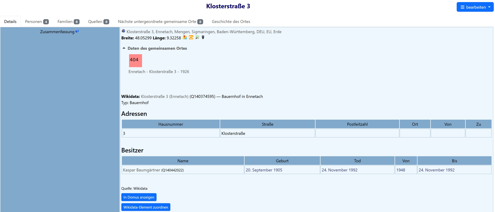

# **webtrees** module: Wikidata Places


[](version.txt)
[](https://github.com/hartenthaler/hh_wikidata_places/releases)
[](https://www.gnu.org/licenses/gpl-3.0)

Wikidata Places connects [Vesta Shared Places](https://github.com/vesta-webtrees-2-custom-modules/vesta_shared_places) (`_LOC`) in [webtrees](https://www.webtrees.net) with public information from Wikidata. It keeps genealogical data in webtrees and uses Wikidata as a read-only external source.

## 📚 Contents

* [Purpose](#purpose)
* [Main features](#main-features)
* [Screenshot](#screenshot)
* [Domus](#domus)
* [Privacy](#privacy)
* [Requirements](#requirements)
* [Installation](#installation)
* [Documentation](#documentation)
* [Translation](#translation)
* [Credits](#credits)
* [License](#license)

## 🎯 Purpose

A shared place can represent a building, farm, church, cemetery, street, square, district, village or another real-world place. This module stores a Wikidata QID alongside the shared-place record and displays public Wikidata information such as its label, description, type and image.

The module does not synchronize with Wikidata or send genealogical person data to Wikidata. Assigning, replacing or removing a QID is always an explicit action by a user who may edit the shared place. Read-only display never changes GEDCOM data.

## 🏠 Domus

[Domus](https://domus.genealogy.net) is an open application for researching the history of houses and buildings. It complements webtrees: webtrees remains the place for private genealogical data, while Domus can provide specialised public research and map views. **Show in Domus** opens the linked Wikidata item in Domus in a new tab. Without a Wikidata link, it opens the Domus map start page. The module does not embed Domus or synchronize data with it.

## ⚙️ Main features

The current release provides:

* recognising Wikidata identifiers stored as `_EXID` with the Wikidata entity authority URI;
* validating QIDs and keeping other external identifiers untouched;
* loading and caching public Wikidata entity information;
* displaying read-only Wikidata information through Vesta's place-information provider mechanism;
* using the webtrees language with a sensible fallback; and
* showing Wikidata and Wikimedia Commons provenance for displayed data and images;
* a protected search page for finding, reviewing and manually assigning Wikidata items; and
* controlled removal and replacement of stored QIDs, including an explicit offer to replace a redirected Wikidata item and an updated shared-place change record; and
* an editor-only nearby search for shared places with coordinates, ordered by name similarity and distance; and
* a read-only outbound link to Domus, using its documented QID deep link where available.
* historical addresses from Wikidata, when the linked item actually has an address statement.
* public Wikidata owners and occupants with external links, known life dates and historical relationship dates.

## 🖼️ Screenshot

The shared-place summary keeps the local genealogy record in webtrees and adds a compact, read-only Wikidata panel.



## 🔒 Privacy

When a Wikidata entry is loaded, the server requests only the public Wikidata QID and the requested display language. A nearby search also sends the shared place's coordinates and the configured radius to Wikidata. Standard technical request metadata is sent by the server. The module never sends names of living people, family relationships, private notes, sources or other genealogical data.

Responses are cached locally. If Wikidata is temporarily unavailable, the normal Vesta Shared Place page remains available.
When the optional Legal Notice module is active, it includes Wikidata in the generated privacy policy together with the purpose of the request and the transferred technical data.

## 📌 Requirements

* webtrees 2.2.x
* Vesta Shared Places
* PHP with HTTPS access to the Wikidata APIs for live enrichment; cached data remains usable while offline

## 📥 Installation

1. Download the [latest release](https://github.com/hartenthaler/hh_wikidata_places/releases/latest).
2. Unzip it into the `modules_v4` directory of your webtrees installation.
3. Ensure that the directory is named `hh_wikidata_places`.
4. In the webtrees control panel, enable **Wikidata Places**.
5. In the Vesta Shared Places configuration, enable **Wikidata Places** as a place-information provider.

An editor can use **Assign Wikidata item** on the shared-place page to search Wikidata and choose an item. The module stores it as an external identifier with the Wikidata authority URI:

```gedcom
1 _EXID Q123456
2 TYPE https://www.wikidata.org/entity/
```

If an existing item has been merged or redirected by Wikidata, the assignment page shows the replacement QID and lets the editor apply it explicitly.

For a shared place with GEDCOM `MAP`, `LATI` and `LONG` coordinates, editors can also use **Search nearby**. The module shows at most 20 candidates inside the configured radius. It ranks suggestions by matching name and distance, but never creates a link automatically. Administrators can choose the radius independently for every family tree in the module's configuration.

Search results use a compact table. It shows the item label and QID, its description and—where applicable—its distance. The link icon opens the public Wikidata item; **Assign** remains an explicit editor action.

When Wikidata provides address statements, the shared-place page shows a read-only address table with house number, street, postal code, place and optional validity dates. It is intentionally omitted for items without address data, such as most settlements or administrative areas.

Where Wikidata contains them, the same panel also shows public owners and occupants. These are external Wikidata facts: no webtrees person is linked, changed or created. The table gives the public Wikidata name and link, known birth/death dates and the period of the relationship.

## 📖 Documentation

* [Concept: Wikidata and Domus integration](docs/WIKIDATA_DOMUS_CONCEPT.md)
* [Roadmap](docs/ROADMAP.md)
* [Development notes](docs/DEVELOPMENT.md)
* [Historical address model](docs/HISTORICAL_ADDRESSES.md)
* [Owner and occupant metadata](docs/OWNER_AND_OCCUPANT_METADATA.md)
* [Version 2 roadmap](docs/ROADMAP.md)
* [Changelog](CHANGELOG.md)

## 🌐 Translation

The module uses the standard webtrees gettext translation system. Translation files are kept in `resources/lang`; German is currently available. Contributions are welcome as pull requests.

## 🙏 Credits

* [webtrees](https://www.webtrees.net)
* [Vesta Shared Places](https://github.com/vesta-webtrees-2-custom-modules/vesta_shared_places)
* [Wikidata](https://www.wikidata.org) and [Wikimedia Commons](https://commons.wikimedia.org)
* David Straub for developing [Domus](https://domus.genealogy.net), and the Domus community

## ⚖️ License

This module is licensed under [GPL-3.0-or-later](LICENSE).
